<!-- Onkar Nagargoje · Profile README · Repo: Onkarnagargoje/Onkarnagargoje -->

<!-- Header: high-contrast cyber gradient (works on GitHub dark mode) -->

  

  

<!-- Live-style counters -->

  

  

<table width="100%">
<tr>
<td width="55%" valign="top">

Building a career in **Security Operations (SOC)** and **blue-team defense** — dual **B.Tech (CSE)** + **B.Voc (Cyber Security & Digital Forensics)** @ GTMC Nanded / DBATU Lonere.

**Analyst workflow:** `Alerts → Triage → Investigation → Documentation`

| Capability | Proof |
|:--|:--|
| Log triage | [Firewall Log Analyzer](https://github.com/Onkarnagargoje/firewall-log-analyzer) + MITRE hints |
| Network defense | TCP/IP · VLAN · OSPF · ACLs · VPN · Wireshark · GNS3 |
| Enterprise IT | AD basics · O365 · Linux/Windows support |
| Automation | Python & React tools (BugSentry-style prioritization) |

**Leveling up:** Splunk/Elastic basics · Sigma thinking · Security+ path · SOC L1 playbooks

```mermaid
%%{init: {'theme': 'dark', 'themeVariables': { 'primaryColor': '#0ea5e9', 'lineColor': '#22d3ee'}}}%%
flowchart TB
  L[Logs & Alerts] --> T[Triage]
  T --> I[Investigate]
  I --> R[Report / Escalate]
  style L fill:#1e293b,stroke:#38bdf8
  style T fill:#1e3a5f,stroke:#22d3ee
  style I fill:#1e3a5f,stroke:#22d3ee
  style R fill:#312e81,stroke:#a78bfa
```

</td>
<td width="45%" valign="top" align="center">

</td>
</tr>
</table>

<!-- Activity graph — main visual motion on profile -->

 

 

  

| | |
|:---:|:---:|
|  | **Python CLI** — SOC log triage, blocked IP ranking, JSON export, **MITRE** heuristics · [Repo →](https://github.com/Onkarnagargoje/firewall-log-analyzer) |
|  | **React · Firebase · Gemini** — AI severity triage (alert-prioritization mindset) · [Live →](https://nagargojeonkar.netlify.app/) |
|  | **Agentic AI · CV** — monitoring & anomaly-style alerting pipelines |
|  | **ATS / keyword gap** — structured matching (IoC-style rule thinking) |

| Timeline | Role | Org | Highlights |
|:--|:--|:--|:--|
| **2025 – Present** | Web Developer Intern | **Synapsium Technology** | React libs · Firebase · Agile |
| **2025** | Web Dev Intern | **Cognifyz** | WCAG · **20+** bug fixes |
| **2024** | Front-End Intern | **Axino Tech** | Performance & mobile UX |
| **2023–27** | **B.Tech CSE** | GTMC Nanded | DBATU Lonere |
| **2024–27** | **B.Voc Cyber Sec & DF** | DBATU Lonere | Forensics track |

**Certs & wins:** CCNA (Networking) Training · Gold Medal — Sport Association Project · DIPEX 2025 · Avishkar Convention

<picture>
  <source media="(prefers-color-scheme: dark)" srcset="https://raw.githubusercontent.com/Onkarnagargoje/Onkarnagargoje/output/snake-dark.svg"/>
  <source media="(prefers-color-scheme: light)" srcset="https://raw.githubusercontent.com/Onkarnagargoje/Onkarnagargoje/output/snake.svg"/>
  
</picture>

  

**Hiring for:** SOC Analyst intern · Junior Blue Team · IT Support → Security track

📧 onkarnagargoje25@gmail.com · 📱 +91 9511841275

 

  

  

<!-- Setup: run GitHub Actions snake.yml + profile-3d.yml once (see profile/.github/workflows/) -->
